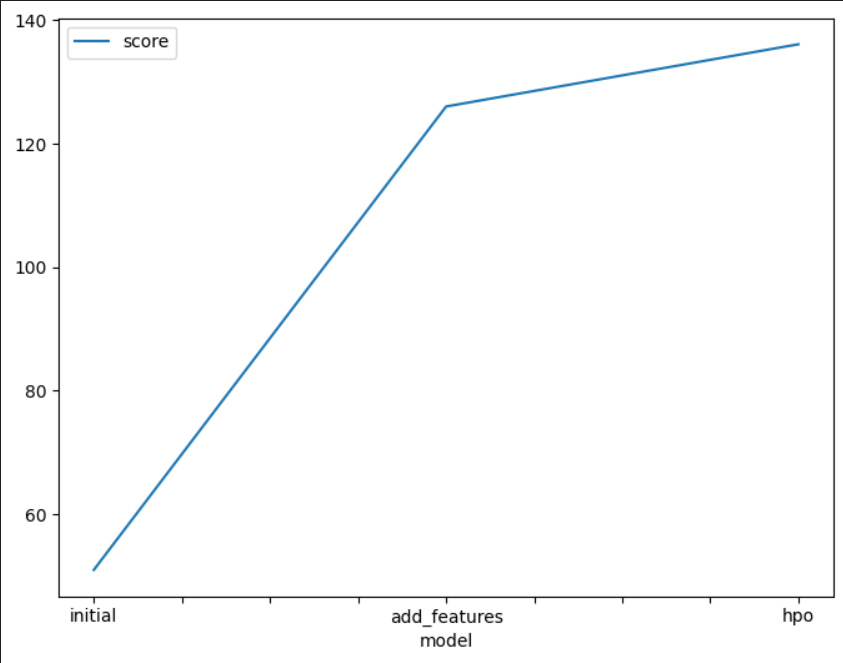
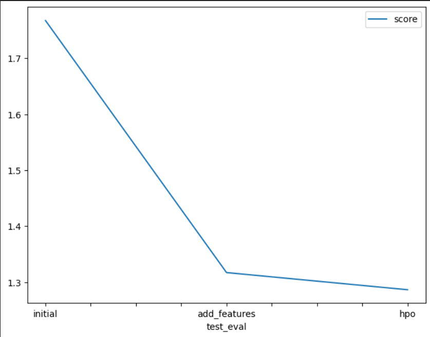

# Report: Predict Bike Sharing Demand with AutoGluon Solution
#### Trung Hoang Quoc

## Initial Training
### What did you realize when you tried to submit your predictions? What changes were needed to the output of the predictor to submit your results?
After editing and submitting my predictions, I saw the results improved compared to previous submissions. That shows me that performing EDA to edit features in the data and optimize hyper parameters is necessary to make the model more effective.

### What was the top ranked model that performed?
The WeightedEnsemble_L2 model 

## Exploratory data analysis and feature creation
### What did the exploratory analysis find and how did you add additional features?
EDA is an important step to optimize the model. In this lab, we edited the features in the data such as separating the datetime feature into smaller day;month;year fetures and making category types with unique column features. (weather, season) helps the model learn better.

### How much better did your model preform after adding additional features and why do you think that is?
When I added the features day, month, year it was very useful when we added to the model and improved the result to 1.31730 compared to the previous submission of 1.76745 on kaggle. Because it can let the model learn during the week which days have the most users renting bicycles...

## Hyper parameter tuning
### How much better did your model preform after trying different hyper parameters?
Fine tuning by finding the most optimal hyper parameters has improved and made my model the best to achieve a result of 1.28665 compared to the previous submission of 1.31730 on kaggle.

### If you were given more time with this dataset, where do you think you would spend more time?
I will spend time analyzing data and processing it best because data plays an important role in determining the accuracy of the model in machine learning.

### Create a table with the models you ran, the hyperparameters modified, and the kaggle score.
|model|hpo1|hpo2|hpo3|score|
|--|--|--|--|--|
|initial|None|None|None|1.76745|
|add_features|None|None|None|1.31730|
|hpo|GBM: num_boost_round 100|Neural Network: learning_rate 1e-4, 1e-2, 5e-4|Neural Network: activation relu, softrelu, tanh|1.28665|

### Create a line plot showing the top model score for the three (or more) training runs during the project.

### Create a line plot showing the top kaggle score for the three (or more) prediction submissions during the project.

## Summary
In this project I learned many things and practiced them such as using AutoGluon, EDA, hyper-parameter tuning which helped improve the model.