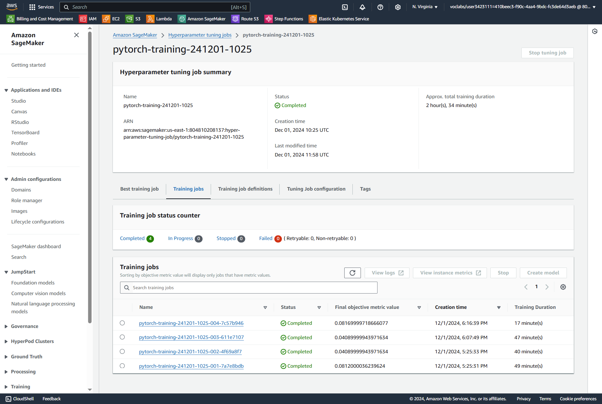
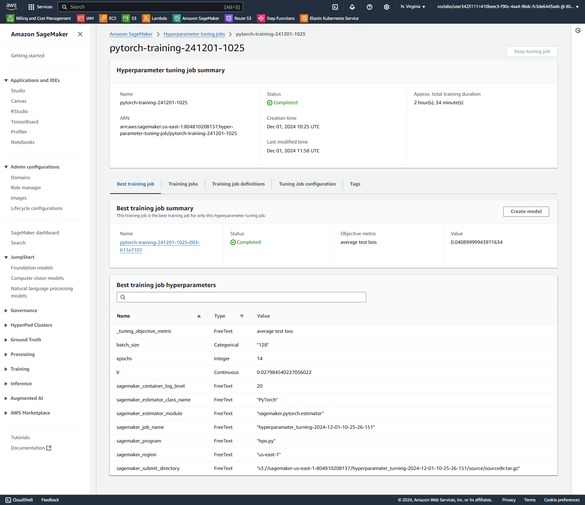
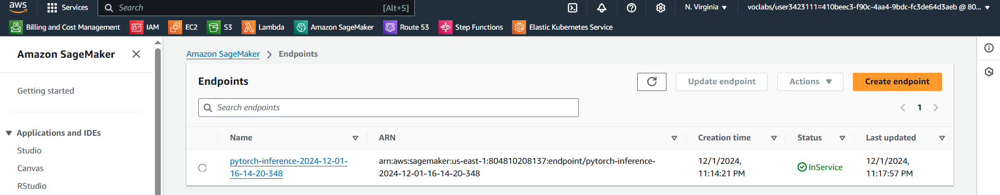

# Image Classification using AWS SageMaker

This project utilizes AWS SageMaker to build, train, and deploy a pretrained image classification model. The model employs AWS tools such as hyperparameter tuning, model profiling, and debugging, with a focus on efficiency and best practices for machine learning workflows. The dataset used can be the provided dog breed classification dataset or any other dataset of your preference.

## Project Setup Instructions
1. Access AWS through the gateway in the course and open SageMaker Studio.
2. Download the starter files from the course or prepare your own if needed.
3. Download [dog breed classification dataset](https://s3-us-west-1.amazonaws.com/udacity-aind/dog-project/dogImages.zip) to classify between different dog breeds in images.
4. Upload Data to S3: Upload the dataset to an S3 bucket through the AWS Gateway to make it accessible for SageMaker.


## Dataset
For this project, I used a dataset containing images of 133 different dog breeds. The dataset is divided into three sets:
- Train: Images used to train the model.
- Validation: Images used to validate the model during training.
- Test: Images used to evaluate the model's performance.

The data is stored in an AWS S3 bucket and is directly accessed by SageMaker for the training process.


## Hyperparameter Tuning
For this experiment, a ResNet-18 model was chosen due to its ability to generalize well on image classification tasks. This model was pretrained on ImageNet and fine-tuned on the dog breed dataset.

Hyperparameters Tuned:
- Learning Rate (lr): Explored in a continuous range from 0.01 to 0.1. This determines the step size at each iteration while moving toward a minimum of the loss function.
- Batch Size: Tuned over a categorical set of values, including 64 and 128, to determine the best balance between memory usage and model performance.
- Epochs: The number of training epochs was set to be between 5 and 15 for fine-tuning the model over several iterations without overfitting.






## Debugging and Profiling
* Debugging: AWS SageMaker’s Debugger was used to monitor the model during training. The smdebug library was integrated into the training script using the DebuggerHookConfig to track important metrics such as gradients, weights, and loss. This helps identify issues like vanishing gradients or improper model training.

* Profiling: SageMaker Profiler was used to track resource utilization, such as CPU, GPU, and memory, throughout the training process. This allowed us to optimize resource allocation and training efficiency. Profiling also helped identify when the GPU was underutilized, suggesting that batch size adjustments or instance type upgrades could improve training speed.


### Results

Profiling and debugging provided the following insights:

- GPU Utilization: The profiling report showed that the GPU was underutilized during training, indicating that increasing the batch size could improve resource usage and reduce training time.
- Training Stability: Debugging confirmed that the model’s gradients and loss values were stable, with no signs of vanishing gradients or other common training issues.
- Resource Optimization: Profiling suggested that adjusting the instance type or batch size could further optimize resource allocation and accelerate training.

Profiler file: [Here](profiler-report.html)


## Model Deployment
In this project, the model is deployed using AWS SageMaker to provide real-time inference through a fully managed endpoint. The model is based on the ResNet-18 architecture and is fine-tuned for dog breed classification with 133 classes.

The model was deployed using the PyTorchModel class, which handles the loading of model artifacts and inference scripts. Here’s how the model was deployed:
```python 
s3_model_artifacts = "s3://sagemaker-us-east-1-804810208137/pytorch-training-2024-12-01-12-15-08-456/output/output.tar.gz"
pytorch_model = PyTorchModel(
    model_data=s3_model_artifacts, 
    role=sagemaker.get_execution_role(), 
    entry_point='inference.py',
    py_version='py3',
    framework_version='1.8',
    predictor_cls=ImagePredictor
)

predictor = pytorch_model.deploy(initial_instance_count=3,  instance_type='ml.m5.large')
```
- Model Artifacts: The model is stored in an S3 bucket, and SageMaker loads it during the deployment.
- Instance Type: The model is deployed on ml.m5.large instances for inference, with 3 instances to handle the expected load.


Querying the Endpoint: Once the model is deployed, it is accessible via the SageMaker endpoint. The model can be queried by providing an image, and the prediction will return the class of the dog breed.
```python 
response=predictor.predict(image_bytes, initial_args={"ContentType": "image/jpeg"})

```

Image of the model that was successfully deployed:
